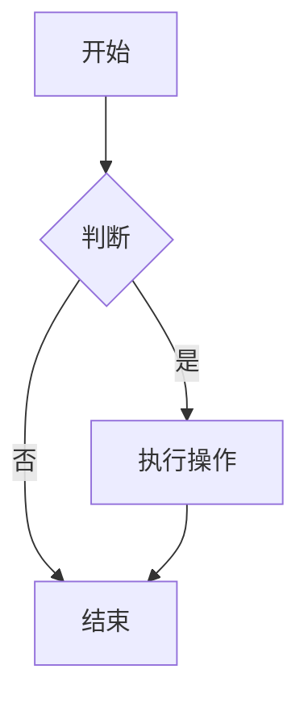

# Markdown 文档编写指南

## 📋 Markdown 基础语法

### 1. 标题

```
# 一级标题
## 二级标题
### 三级标题
#### 四级标题
##### 五级标题
###### 六级标题
```

### 2. 文本格式

```
**粗体文本** 或 __粗体文本__
*斜体文本* 或 _斜体文本_
***粗斜体文本*** 或 ___粗斜体文本___

~~删除线文本~~

`行内代码`

==高亮文本==（部分解析器支持）
```

### 3. 列表

```
#### 无序列表
* 项目1
* 项目2
  * 子项目2.1
  * 子项目2.2
- 另一种方式
+ 又一种方式

#### 有序列表
1. 第一项
2. 第二项
   3. 子项2.1
   4. 子项2.2
5. 第三项

#### 任务列表
- [x] 已完成任务
- [ ] 未完成任务
- [ ] 另一个任务
```

### 4. 链接和图片

```
#### 链接
[链接文本](https://example.com "可选标题")

#### 引用式链接
这是一个[引用链接][id]
[id]: https://example.com "标题"

#### 图片


#### 带尺寸的图片

```

### 5. 代码块

````
#### 行内代码
使用 `printf()` 函数

#### 代码块（无语法高亮）
```
function test() {
  console.log("hello");
}
```

#### 代码块（带语法高亮）
```javascript
function hello() {
  console.log("Hello World!");
}
```

#### 代码块（带文件名）
```java:Main.java
public class Main {
    public static void main(String[] args) {
        System.out.println("Hello");
    }
}
```
````

### 6. 表格

```
| 左对齐 | 居中对齐 | 右对齐 |
| :----- | :------: | -----: |
| 单元格 | 单元格   | 单元格 |
| 单元格 | 单元格   | 单元格 |

#### 更复杂的表格
| 特性 | 描述 | 示例 |
|------|------|------|
| **粗体** | 重要信息 | `重要内容` |
| *斜体* | 强调 | _强调文本_ |
| ~~删除线~~ | 已删除 | ~~旧内容~~ |
```

### 7. 引用块

```
> 这是引用
> 可以多行

> 嵌套引用
>> 二级引用
>>> 三级引用

> 引用中也可以包含其他元素
> 
> 1. 列表项
> 2. 另一个列表项
> 
> `代码`
> 
> **粗体文本**
```

### 8. 水平线

```
---
***
___
```

### 9. 脚注

```
这是一个带有脚注的句子。

: 这是脚注内容。
```

---

## 🎨 高级格式

### 1. 定义列表

```
术语1
: 定义1

术语2
: 定义2a
: 定义2b
```

### 2. 数学公式（GitHub Flavored Markdown）

```
#### 行内公式
这是一个行内公式：$E = mc^2$

#### 块级公式
$$
\frac{n!}{k!(n-k)!} = \binom{n}{k}
$$
```

### 3. 流程图和图表（Mermaid）

````

````

### 4. 目录（部分解析器支持）

```
[TOC]

<!-- 或 -->
[[_TOC_]]
```

---

## 📊 技术文档结构

### 1. 文档头部

```
# 项目名称

> 简短的项目描述

**版本**: v1.0.0  
**最后更新**: 2024-01-15  
**作者**: 作者姓名  
**状态**: ✅ 完成 / 🚧 进行中 / 📋 计划中  

---

## 目录
- [快速开始](#快速开始)
- [安装指南](#安装指南)
- [使用说明](#使用说明)
- [API参考](#api参考)
- [示例代码](#示例代码)
- [常见问题](#常见问题)
- [贡献指南](#贡献指南)
- [许可证](#许可证)
```

### 2. 快速开始部分

```
## 🚀 快速开始

### 安装
```

bash

# 使用 npm 安装

npm install package-name

# 使用 yarn 安装

yarn add package-name

```
### 基本使用
```

javascript

// 导入模块

const package = require('package-name');

// 基本示例

const result = package.doSomething();

console.log(result);

### 3. 详细说明部分

```
## 📖 详细说明

### 功能特性
- ✅ **特性1**: 详细描述
- ✅ **特性2**: 详细描述
- 🔄 **特性3**: 正在开发中
- 📋 **特性4**: 计划开发

### 架构设计
```

mermaid

graph TB

A[客户端] --> B(API网关)

B --> C{负载均衡}

C --> D[服务1]

C --> E[服务2]

D --> F[数据库]

E --> F

```
### 配置选项
| 参数 | 类型 | 默认值 | 描述 |
|------|------|--------|------|
| `host` | string | `localhost` | 服务器地址 |
| `port` | number | `8080` | 服务器端口 |
| `timeout` | number | `5000` | 超时时间(毫秒) |
```

### 4. API 参考部分

```
## 🔧 API 参考

### 类：ClassName

#### 构造函数
```

javascript

new ClassName(options)

```
**参数**:
- `options` (Object): 配置对象
  - `name` (string): 名称
  - `enabled` (boolean): 是否启用

#### 方法

##### methodName(params)
执行某些操作。

**参数**:
- `params` (Object): 参数对象
  - `type` (string): 类型

**返回值**:
- (Promise): 返回 Promise 对象

**示例**:
```

javascript

const instance = new ClassName();

const result = await instance.methodName({ type: 'test' });

```
##### anotherMethod(value)
另一个方法。

| 参数 | 类型 | 必填 | 描述 |
|------|------|------|------|
| `value` | string | 是 | 输入值 |

**异常**:
- `Error`: 当参数无效时抛出

#### 属性

##### propertyName
获取或设置属性。

**类型**: string  
**默认值**: `'default'`  
**可写**: 是
```

### 5. 示例代码部分

```
## 💡 示例代码

### 基础示例
```

java

public class HelloWorld {

public static void main(String[] args) {

System.out.println("Hello, World!");

}

}

```
### 进阶示例
<details>
<summary>点击展开完整示例</summary>
```

java

import java.util.*;

public class AdvancedExample {

private List<String> items = new ArrayList<>();

```
public void addItem(String item) {
    items.add(item);
}

public void printItems() {
    items.forEach(System.out::println);
}
```

}

```
</details>
```

### 6. 常见问题部分

```
## ❓ 常见问题

### Q1: 问题描述？
**A**: 解答内容。

### Q2: 另一个问题？
**A**: 详细解答。

<details>
<summary>点击查看更多问题</summary>

### Q3: 隐藏的问题？
**A**: 详细解答。
</details>
```

---

## 🎯 最佳实践

### 1. 文档结构

```
# 项目名称

> 一句话描述

## 目录
- [简介](#简介)
- [安装](#安装)
- [快速开始](#快速开始)
- [详细指南](#详细指南)
- [API 参考](#api-参考)
- [示例](#示例)
- [常见问题](#常见问题)
- [贡献](#贡献)
- [许可证](#许可证)

## 简介
项目背景、目的、目标用户。

## 安装
详细的安装步骤。

## 快速开始
最简单的使用示例。

## 详细指南
深入的功能说明。

## API 参考
完整的 API 文档。

## 示例
多种使用场景的示例。

## 常见问题
常见问题解答。

## 贡献
如何参与贡献。

## 许可证
许可证信息。
```

### 2. 写作规范

```
# 遵循的规范

## 标题
- 使用 # 表示标题层级
- 保持标题层级正确
- 标题后不添加标点

## 列表
- 使用 - 创建无序列表
- 嵌套列表使用两个空格缩进
- 列表项使用一致的标记

## 代码块
- 指定语言以获得语法高亮
- 长代码块应包含行号
- 提供代码说明

## 链接
- 使用描述性的链接文本
- 相对链接用于内部文档
- 外部链接添加标题属性

## 图片
- 使用清晰的图片
- 添加替代文本
- 指定合适的大小
```

### 3. SEO 优化

```
# SEO 最佳实践

## 标题优化
- 使用包含关键词的标题
- 标题层级清晰
- 每个文档一个 H1 标题

## 内容优化
- 关键词自然分布
- 使用内部链接
- 添加外部参考链接

## 元数据
- 添加描述性摘要
- 使用相关标签
- 包含作者信息
```

---

## 🔧 工具推荐

### 1. Markdown 编辑器

|工具|平台|特点|
|---|---|---|
|Typora|跨平台|所见即所得，支持主题|
|VS Code|跨平台|强大插件，集成开发|
|Obsidian|跨平台|双向链接，知识管理|
|Notion|Web|协作功能强大|
|印象笔记|跨平台|云同步，剪藏功能|

### 2. 实用插件/扩展

```
## VS Code 插件
- **Markdown All in One**: 全面增强
- **Markdown Preview Enhanced**: 增强预览
- **Markdownlint**: 语法检查
- **Mermaid Preview**: 图表预览
- **Paste Image**: 粘贴图片

## Chrome 扩展
- **Markdown Viewer**: 查看 Markdown 文件
- **Markdown Editor**: 在线编辑
- **Markdown Here**: 转换 Markdown 为 HTML
```

### 3. 在线工具

```
## 编辑器
- [StackEdit](https://stackedit.io/): 在线 Markdown 编辑器
- [Dillinger](https://dillinger.io/): 实时预览
- [Markdown Tables Generator](https://www.tablesgenerator.com/markdown_tables): 表格生成

## 转换工具
- [Pandoc](https://pandoc.org/): 文档格式转换
- [GitHub Flavored Markdown](https://github.github.com/gfm/): GFM 规范
- [CommonMark](https://commonmark.org/): 标准规范
```

---

## 🎨 主题和样式

### 1. 使用 Emoji

```
## 常用 Emoji 标签

### 状态标记
- ✅ 完成
- 🚧 进行中
- 📋 计划中
- ⚠️ 警告
- ❌ 错误
- 🔴 高优先级
- 🟡 中优先级
- 🟢 低优先级

### 类型标记
- 📝 文档
- 🐛 Bug
- ✨ 新功能
- 🔧 工具
- 📦 依赖
- 🔒 安全
- 🚀 性能
- ♻️ 重构

### 提示标记
- 💡 提示
- ⚡ 快速
- 📚 参考
- 🔍 查看
- 💬 评论
- ⬆️ 升级
- ⬇️ 降级
```

### 2. 自定义样式（HTML）

````
```html
<div class="warning" style="
    background-color: #fff3cd;
    border-left: 4px solid #ffc107;
    padding: 12px;
    margin: 16px 0;
    border-radius: 4px;
">
⚠️ **警告**: 这是一个自定义警告框。
</div>

<div class="info" style="
    background-color: #d1ecf1;
    border-left: 4px solid #17a2b8;
    padding: 12px;
    margin: 16px 0;
    border-radius: 4px;
">
ℹ️ **信息**: 这是一个自定义信息框。
</div>

<div class="tip" style="
    background-color: #d4edda;
    border-left: 4px solid #28a745;
    padding: 12px;
    margin: 16px 0;
    border-radius: 4px;
">
💡 **提示**: 这是一个自定义提示框。
</div>
```
````

### 3. 进度条和状态

```
## 项目进度

### 功能开发
- 功能 A: ██████████ 100%
- 功能 B: ███████░░░ 70%
- 功能 C: ██░░░░░░░░ 20%

### 状态标签
<span style="
    background-color: #007bff;
    color: white;
    padding: 2px 8px;
    border-radius: 12px;
    font-size: 12px;
">进行中</span>

<span style="
    background-color: #28a745;
    color: white;
    padding: 2px 8px;
    border-radius: 12px;
    font-size: 12px;
">已完成</span>
```

---

## 📝 文档模板

### 1. API 文档模板

```
# API 文档

## 概述
简要描述 API 的功能和用途。

## 认证
描述认证方式。

## 端点

### GET /api/resource
获取资源列表。

#### 请求参数
| 参数 | 类型 | 必填 | 描述 |
|------|------|------|------|
| `page` | integer | 否 | 页码 |
| `limit` | integer | 否 | 每页数量 |

#### 响应
```

json

{

"status": "success",

"data": [],

"pagination": {

"page": 1,

"total": 100

}

}

```
#### 状态码
- 200: 成功
- 401: 未授权
- 500: 服务器错误

### POST /api/resource
创建新资源。

#### 请求体
```

json

{

"name": "string",

"description": "string"

}

```
## 错误处理
统一错误格式。
```

### 2. 配置文档模板

```
# 配置说明

## 环境变量
| 变量名 | 类型 | 默认值 | 描述 |
|--------|------|--------|------|
| `DATABASE_URL` | string | - | 数据库连接字符串 |
| `PORT` | number | `3000` | 服务端口 |

## 配置文件
```

yaml

database:

host: localhost

port: 5432

username: admin

password: secret

server:

port: 3000

log_level: info

```
## 配置示例
<details>
<summary>开发环境配置</summary>
```

yaml

database:

host: localhost

port: 5432

username: dev

password: dev123

server:

port: 3001

log_level: debug

```
</details>
```

---

## 🔍 实用技巧

### 1. 自动生成目录

```
## 目录
- [安装](#安装)
- [使用](#使用)
  - [基础使用](#基础使用)
  - [高级功能](#高级功能)
- [API](#api)
```

### 2. 折叠内容

```
<details>
<summary>点击查看详细内容</summary>

这里是详细内容...

### 子标题
更多内容...
```

python

print("代码示例")

```
</details>
```

### 3. 锚点链接

```
跳转到[另一个标题](#另一个标题)

## 另一个标题 {#another-title}
这样也可以跳转
```

### 4. 注意事项提示

````
> **注意**: 这是一个重要提示。

> **警告**: 这是一个警告。

> **提示**: 这是一个小提示。

> **信息**: 这是一条信息。

```diff
- 删除的代码
+ 新增的代码
! 修改的代码
```
````

### 5. 版本对比

```
| 特性 | v1.0 | v2.0 | v3.0 |
|------|------|------|------|
| 功能 A | ✅ | ✅ | ✅ |
| 功能 B | ❌ | ✅ | ✅ |
| 功能 C | ❌ | ❌ | ✅ |
```

---

## 📋 完整的 Markdown 文档示例

```
# Java List 遍历方式指南

> 本文档详细介绍了 Java 中 List 的多种遍历方式及其适用场景

**版本**: v1.1.0  
**最后更新**: 2024-01-15  
**作者**: 技术文档团队  
**状态**: ✅ 已完成  

---

## 目录
- [概述](#概述)
- [五种遍历方式](#五种遍历方式)
  - [迭代器遍历](#迭代器遍历)
  - [增强 for 循环](#增强-for-循环)
  - [Lambda 表达式](#lambda-表达式)
  - [普通 for 循环](#普通-for-循环)
  - [列表迭代器](#列表迭代器)
- [性能对比](#性能对比)
- [最佳实践](#最佳实践)
- [常见问题](#常见问题)
- [总结](#总结)

## 概述
在 Java 编程中，List 是最常用的集合类型之一。了解不同的遍历方式及其特点对于编写高效、可维护的代码至关重要。

## 五种遍历方式

### 迭代器遍历
```

java

Iterator<String> it = list.iterator();

while (it.hasNext()) {

String s = it.next();

System.out.println(s);

}

```
**优点**:
- ✅ 可以在遍历中安全删除元素
- ✅ 适用于所有 Collection 实现

**缺点**:
- ❌ 代码相对冗长
- ❌ 只能单向遍历

### 增强 for 循环
```

java

for (String s : list) {

System.out.println(s);

}

```
**适用场景**: 简单的只读遍历

### Lambda 表达式
```

java

list.forEach(System.out::println);

```
## 性能对比
| 遍历方式 | 时间复杂度 | 空间复杂度 | 适用场景 |
|---------|-----------|-----------|---------|
| 普通 for 循环 | O(n) | O(1) | 需要索引操作 |
| 增强 for 循环 | O(n) | O(1) | 简单遍历 |
| 迭代器遍历 | O(n) | O(1) | 需要删除元素 |

## 最佳实践
1. **选择建议**: ...
2. **注意事项**: ...

## 常见问题
### Q1: 如何在遍历中删除元素？
**A**: 推荐使用迭代器的 `remove()` 方法...

### Q2: 哪种方式性能最好？
**A**: 对于 ArrayList，普通 for 循环性能最佳...

## 总结
根据具体需求选择合适的遍历方式...
```

---

## 🎯 总结

### 核心原则

1. **清晰性**: 文档结构清晰，层次分明
    
2. **完整性**: 内容全面，覆盖所有要点
    
3. **一致性**: 格式统一，风格一致
    
4. **可读性**: 语言简洁，易于理解
    
5. **实用性**: 提供实际可用的示例
    

### 文档维护

```
## 更新日志

### v1.0.0 (2024-01-15)
- ✅ 初始版本发布
- ✅ 包含五种遍历方式
- ✅ 添加性能对比表格

### v1.1.0 (2024-01-20)
- ✅ 新增最佳实践章节
- ✅ 添加常见问题解答
- 🔧 修复示例代码错误

## 贡献指南
欢迎提交 Issue 或 Pull Request 改进本文档。

## 许可证
本文档采用 [CC BY 4.0](https://creativecommons.org/licenses/by/4.0/) 许可证。
```

遵循这些指南，您可以创建出专业、美观、实用的 Markdown 文档。记得根据实际需求调整内容和格式，确保文档能够有效地传达信息。